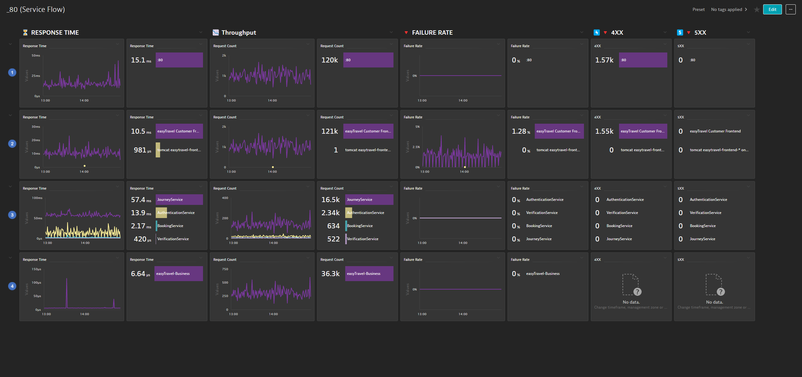
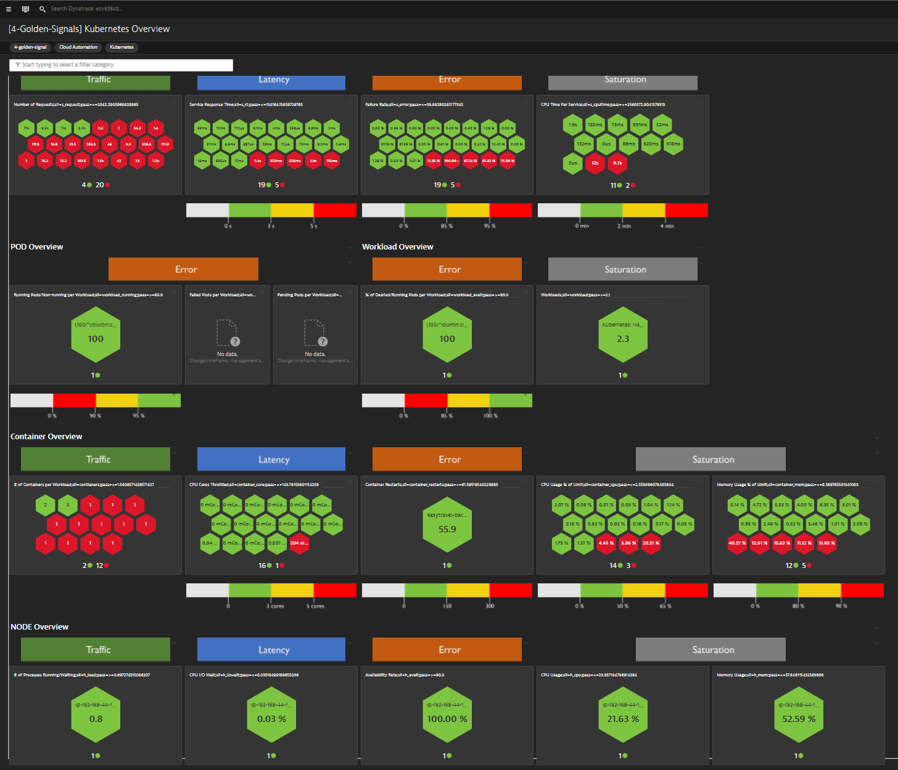

> **_Disclaimer:_** This script is not supported by Dynatrace. Please utilize github issues for any issues that arrise. We will try our best to get to your issues.

# Dynatrace Cloud Automation
Content for Dynatrace Cloud Automation related Observability Clinics

## 1. SLO Automation

[SLO Automation](slo-automation/README.md) is to auto generate slos based on a entities using monaco.

## 2. Release Automation

[Release Automation](release-automation/README.md) is to auto generate deployment release based on a entities.

## 3. Release Validation Dashboards

[This project](release-validation-dashboards/README.md) is to auto generate release validation dashboards based on a technology templates and based on a reference timeframe that is used to auto set thresholds.

## 4. 4 Golden Signals Service Flow Dashboard

[4 Golden Signals Service Flow](4-golden-signals-serviceflow/README.md) is to auto generate 4 golden signals service flow dashboards.

## 5. 4 Golden Signals Kubernetes Dashboard

[4 Golden Signals Kubernetes](4-golden-signals-kubernetes/README.md) is to auto generate 4 golden signals service flow dashboards.

## 6. SonarQube
[sonarqube-metrics](sonarqube-metrics/README.md) this script uses the SonarQube API to gather requested project data, reformats that data into proper ingestable strings [documented here](https://www.dynatrace.com/support/help/extend-dynatrace/extend-metrics/reference/metric-ingestion-protocol#metadata) and sends them off to a Dynatrace insatnce to be ingested. 

## 7. Monaco v2 Templates 
[monacov2-templates](monacov2-templates/README.md) project of monaco v2 templates for every configuration and setting in Dynatrace.