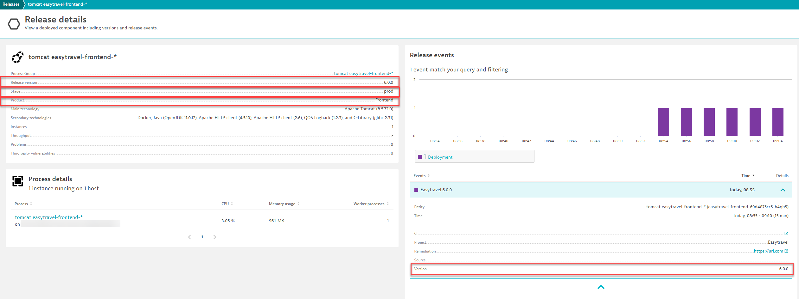
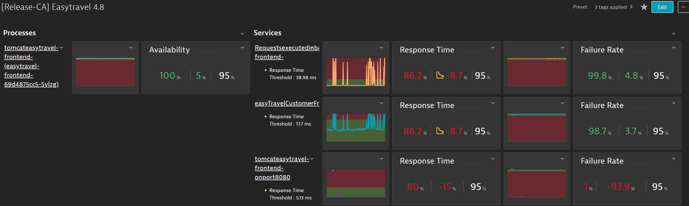
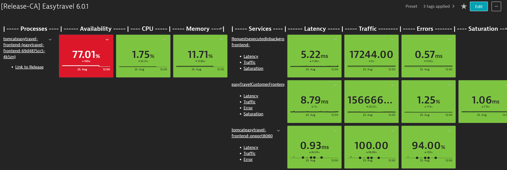

## Disclaimer
These projects are not supported by Dynatrace. 

Any issues please utilize github issues. 
We will try our best to get to your issues.

# Release Automation

This is a CA Project that automates sending of deployment release to Dynatrace. As well as, generating SLOs and a release dashboard.

### CA Release Automation



## Pre-requisites 
1. Create a Dynatrace API-Token with the following permissions

To learn more about API Tokens check out [Dynatrace API Tokens](https://www.dynatrace.com/support/help/dynatrace-api/basics/dynatrace-api-authentication)

```
API v2 scopes
- Read entities
- Read Metrics
- Ingest events
- Read SLO
- Write SLO

API v1 scopes
- Read configuration
- Write configuration
- Access problem and event feed, metrics, and topology
```
## Pre-requisites (Python)

2. Installing Python Version 3

```bash
https://www.python.org/download/releases/3.0/
```

3. Installing Python Libaries
```bash
pip install -r stable-req.txt
```

## Usage of Automated Releases

1. Execute the Automated Release Script
###### &nbsp;&nbsp;&nbsp;&nbsp;&nbsp;&nbsp;&nbsp;&nbsp;&nbsp;&nbsp;&nbsp;&nbsp;Supported Args:
###### &nbsp;&nbsp;&nbsp;&nbsp;&nbsp;&nbsp;&nbsp;&nbsp;&nbsp;&nbsp;&nbsp;&nbsp;&nbsp;&nbsp;&nbsp;&nbsp;&nbsp;&nbsp;Required:
-  -dtUrl  --dynatrace-url Dynatrace URL (https://*.live.com)
-  -dtToken  --dynatrace-api-token Dynatrace API Token
-  -identifier  --identifier Id of the service,process group, process group instance or tag you are interested in.
-  -owner  --dashboard-owner  Owner of the Dynatrace Dashboard
-  -shared  --dashboard-shared  Set Dynatrace Dashboard to shared
-  -preset  --dashboard-preset  Set Dynatrace Dashboard to preset
-  -timeFrame  --dashboard-timeFrame Time Frame to evaluate thresholds
-  -pass --pass-percent Percent at which to be passed via threshold
-  -ver --version Version of the release
-  -proj --project Project of the release
-  -stage --stage Stage of the release
-  -product --product Product of the release
-  -remUrl --remediationUrl Remediation Url of the Release
-  -sloTarg --slo-target Target for the SLOs
-  -sloWarn --slo-warning Warning for the SLOs

###### &nbsp;&nbsp;&nbsp;&nbsp;&nbsp;&nbsp;&nbsp;&nbsp;&nbsp;&nbsp;&nbsp;&nbsp;&nbsp;&nbsp;&nbsp;&nbsp;&nbsp;&nbsp;Optional:
-  -slo --auto-slo Automatically Generate SLOs
-  -dashboard --auto-dashboard Automatically Generate Release Dashboard

### PYTHON
```bash
 py .\releaseauto.py -dtUrl DTURL -dtToken DTTOKEN -identifier IDENTIFIER -ver VERSION -proj PROJECT -remUrl https://url.com -owner OWNER -shared SHARED -preset PRESET -timeFrame TIMEFRAME -pass PASS -slo -dashboard    
 ```

 Example(SLO):
 ```bash
 py .\releaseauto.py -dtUrl https://{DTTENANT}.live.com -dtToken {DTTOKEN} -identifier [Kubernetes]app:easytravel-frontend -ver 6.0.0 -proj Easytravel -product Frontend -stage prod -remUrl https://url.com -owner {DTUSERNAME} -shared true -preset true -timeFrame now-1d -pass 50 -sloTarg 95 -sloWarn 97.5 -slo -dashboard
 ```
 
 

  Example(no SLO):
 ```bash
 py .\releaseauto.py -dtUrl https://{DTTENANT}.live.com -dtToken {DTTOKEN} -identifier [Kubernetes]app:easytravel-frontend -ver 6.0.0 -proj Easytravel -product Frontend -stage prod -remUrl https://url.com -owner {DTUSERNAME} -shared true -preset true -timeFrame now-1d -pass 50 -dashboard
 ```

 