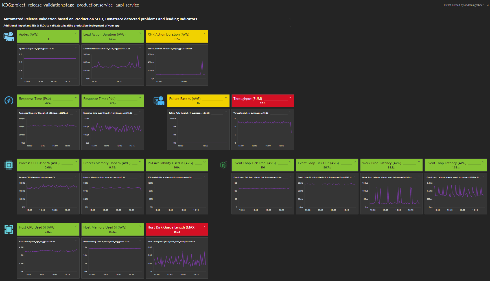
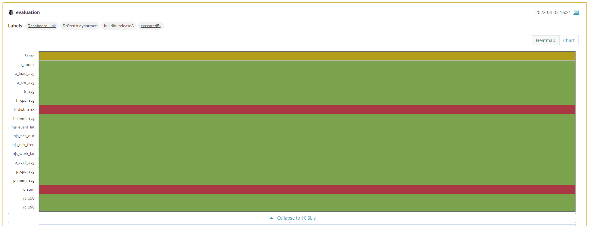

# Dynatrace Release Validation Dashboard

This is a Cloud Automation project that automates the creation of Dynatrace Cloud Automation Release Validation Dashoards for different base technologies including automated thresholds based on a reference timeframe.

This project creates a Dynatrace Monaco based dashboard configuration that you can use to create a dashboard as shown below which includes:
1. Best practice indicators for the selected technology
2. Automatic thresholds based on a reference timeframe



This dashboard can then be used to automate your release validation!

## Credit goes to Arijan Zenuni

All credit for this project goes to [Arijan Zenuni](https://github.com/ajzenuni) who took the lead of implementing the initial working version of this project. Thank you very much for stepping up and building this!

## Pre-requisites 

1. Installing Dynatrace Monaco

```bash
https://dynatrace-oss.github.io/dynatrace-monitoring-as-code/Get-started/installation
```

2. Create a Dynatrace API-Token with the following permissions

To learn more about API Tokens check out [Dynatrace API Tokens](https://www.dynatrace.com/support/help/dynatrace-api/basics/dynatrace-api-authentication)

```
API v2 scopes
- Read entities
- Write entities
- Read settings
- Write settings
- Read metrics

API v1 scopes
- Read configuration
- Write configuration
```

3. Set Environment Variables
```bash
 export DT_API_TOKEN="DT.***********.*****************"
 export DT_TENANT="*.live.dynatrace.com"
```
5. Installing Python Version 3

```bash
https://www.python.org/download/releases/3.0/
```

6. Installing Python Libaries
```bash
pip install -r requirements.txt
```

## Usage to create release automation dashboard
1. Edit the environments.yaml:

- Create a copy of _environments.yaml
```bash
cp _environments.yaml environments.yaml
```

- Replace ENVNAME with your environment name

2. Edit the config.yaml

Start by creating a copy of _config.yaml:
```bash
cp _config.yaml config.yaml
```

The config.yaml contains the configurations of each mz you want to create a cloud automation dashboard. 
The config.yaml contains a setion for the mzs, dashoard and baseline configurations.

- Replace MZNAME with your management zone name
- Select your technology (currently supported - generic,java,nodejs,dotnet, go)
- Replace OWNER with your user in Dynatrace
- Replace PROJECT with your cloud automation project
- Replace STAGE with your cloud atuomation stage
- Replace SERVICE with your cloud atuomation service
- Set your pass conditions for Service,Application,Infrastrucutre

3. Execute the Cloud Automation Dashboard script
- Supported Args:
- -a, --auto-monaco (enables automatic deployment of monaco dashboards) - (missing = false)
- -v, --verify (disables SSL cert verification) - (missing = true)

```bash
python caDashboard.py
```
This will generate a new directory in the project root directory name - {ENVNAME}-{MZNAME}-{TECH}
This is a monaco project that will contain a dashboard.json and a dashboard.yaml. The dashboard.yaml contains all the pass/warn values generated from the baseline

4. Review the dashboard.yaml in the newly created monaco project

The dashboard.yaml contains all metric thresholds based on the reference timeframe. Feel free to adjust the thresholds before applying the dashboard configuration through monaco!

5. Execute Monaco
```bash
	monaco --environments=environments.yaml -p="{ENVNAME}-{MZNAME}-{TECH}"
```

## Use the dashboard with Cloud Automation

To leverage the dashboard for automated validation simply use a Cloud Automation project that has a matching stage and service to your dashboard. Also make sure that this Cloud Automation project uses a dynatrace.conf.yaml that enables the dashboard query capability. Once that is done every evaluation done by your cloud automation project will use your created dashboard as quality gate definition.

