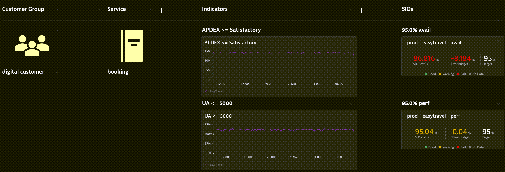

# SLO Dashboard

This is a python script that will create SLO dashboards based on each seperate environment defined in the environments.yaml SLO Monaco configuration.


## Pre-requisites 

1. Installing Python Version 3

```bash
https://www.python.org/download/releases/3.0/
```

2. Installing Python Libaries
```bash
pip install -r requirements.txt
```

## Usage
The SLO MONACO configs should contain the name of the env specified in the environments.yaml. The "Correct EXAMPLE" shows the the env - demo is present in both the environments.yaml and _slo.yaml
### Correct EXAMPLE:
```yaml
demo:
 - name: "demo"
 - env-url: "https://DTURL"
 - env-token-name: "DT_API_TOKEN"
```
#### KSM Perf SLO EXAMPLE:
```yaml
config:
  - demo_slo: "_slo.json"

demo_slo:
  - name: "{EMV} - {APPNAME} - {SERVICE NAME} - perf"
  - serviceId: "SERVICE-{ID}"
  - calcMetric: "service/perf/csm/calculated-metrics-service/demo_calc.name"
  - target: "95.0"
  - warning: "97.5"
  - timeFrame: now-1d
```

### Incorrect EXAMPLE:
```yaml
demo:
 - name: "demo"
 - env-url: "https://DTURL"
 - env-token-name: "DT_API_TOKEN"
```
#### KSM Perf SLO Incorrect EXAMPLE:
```yaml
config:
  - slo: "_slo.json"

slo:
  - name: "{EMV} - {APPNAME} - {SERVICE NAME} - perf"
  - serviceId: "SERVICE-{ID}"
  - calcMetric: "service/perf/csm/calculated-metrics-service/demo_calc.name"
  - target: "95.0"
  - warning: "97.5"
  - timeFrame: now-1d
```

1. Run SLO Monaco First (refer to [SLO Monaco README](./SLO-Monaco#readme)).

2. Execute SLO Dashboard script (in SLO-Dashboard directory)
```bash
python SLO-dashboard.py
```
This will generate a new directory in the project root directory named - {ENV NAME}-dashboard.
This will contain dashboard.json and dashboard.yaml

3. Edit the dashboard.yaml in the {ENV NAME}-dashboard
```yaml
  env:
  - name: {DASHBOARD NAME}
  - owner: OWNER
  - shared: "true"
  - timeFrame: TIMEFRAME
  - preset: "true"
```

4. Use SLO Monaco to generate the SLO Dashboards (in SLO-Monaco directory)
```bash
monaco --environments=environments.yaml -p="{ENV NAME}-dashboard/"
```